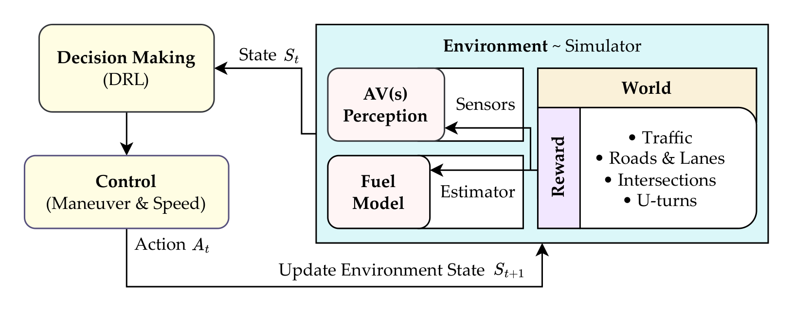

# Towards Collaborative and Fuel-Efficient Maneuvers for Autonomous Vehicles

TODO: Add a brief description of the project.

## Block Diagram

<p align="center">

</p>

TODO: Add a brief description of the block diagram.

## Usage

Clone the repository:

```shell
git clone https://github.com/muhd-umer/twds-cafe-manuevers.git
```

TODO: Add instructions for running the code.

*Note: It is recommended to create a new virtual environment so that updates/downgrades of packages do not break other projects.*